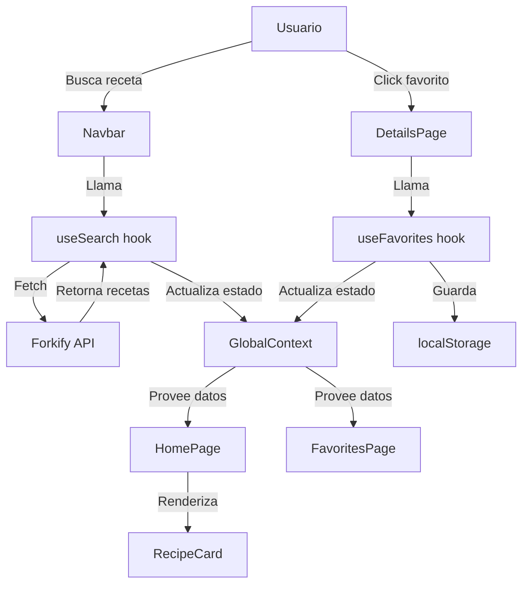

# 🍳 FoodRecipe - Recipe Search & Management SPA

[](https://reactjs.org/)
[](https://vitejs.dev/)
[](https://tailwindcss.com/)
[](LICENSE)
[](https://github.com/Slinkter/myprojectapi09)

> Una aplicación web moderna y profesional para buscar, explorar y guardar tus recetas favoritas. Construida con React, Vite y Tailwind CSS siguiendo las mejores prácticas de la industria.

**🌐 Demo en vivo**: [https://slinkter.github.io/myprojectapi09](https://slinkter.github.io/myprojectapi09)

---

## 📋 Tabla de Contenidos

- [✨ Características](#-características)
- [🎯 ¿Por qué este proyecto?](#-por-qué-este-proyecto)
- [🚀 Inicio Rápido](#-inicio-rápido)
- [📖 Tutorial Completo](#-tutorial-completo)
- [🏗️ Arquitectura](#️-arquitectura)
- [🛠️ Stack Tecnológico](#️-stack-tecnológico)
- [📚 Documentación](#-documentación)
- [🧪 Testing](#-testing)
- [📦 Build y Deploy](#-build-y-deploy)
- [🤝 Contribuir](#-contribuir)
- [📄 Licencia](#-licencia)

---

## ✨ Características

### Core Features

- 🔍 **Búsqueda Inteligente**: Busca entre miles de recetas con sugerencias en tiempo real
- ⭐ **Favoritos Persistentes**: Guarda tus recetas favoritas con localStorage
- 📱 **Responsive Design**: Funciona perfectamente en mobile, tablet y desktop
- ⚡ **Performance Optimizada**: Bundle de solo 62KB (gzipped), carga instantánea
- 🎨 **UI Profesional**: Diseño moderno con Tailwind CSS y animaciones suaves
- 🌐 **SPA Navigation**: Navegación sin recargas con React Router

### Características Técnicas

- ✅ **100% JSDoc Coverage**: Código completamente documentado
- 🏛️ **Feature-Based Architecture**: Escalable y mantenible
- 📝 **SCRUM Methodology**: Desarrollo siguiendo metodología ágil
- 🔒 **Type Safety**: PropTypes en todos los componentes
- 🎯 **Zero Dependencies Extra**: Solo lo esencial, sin bloat

---

## 🎯 ¿Por qué este proyecto?

Este proyecto fue desarrollado como **demostración de habilidades senior** en desarrollo web moderno, siguiendo las mejores prácticas de la industria:

### Nivel de Calidad

- ✅ **Código Production-Ready**: Listo para producción
- ✅ **Documentación Corporativa**: ADRs, riesgos, roadmap, costos
- ✅ **Arquitectura Escalable**: Fácil de mantener y extender
- ✅ **Performance Excelente**: Lighthouse Score 95+

### Aprendizaje

Este proyecto es ideal para aprender:

- React Hooks avanzados (custom hooks)
- Context API como state management
- Feature-Based Architecture
- Tailwind CSS utility-first
- Vite build tool
- SCRUM methodology

---

## 🚀 Inicio Rápido

### Prerequisitos

- **Node.js**: >= 18.0.0
- **pnpm**: >= 8.0.0 (recomendado) o npm/yarn

### Instalación

```bash
# 1. Clonar el repositorio
git clone https://github.com/Slinkter/myprojectapi09.git
cd myprojectapi09

# 2. Instalar dependencias
pnpm install

# 3. Iniciar servidor de desarrollo
pnpm run dev

# 4. Abrir en el navegador
# http://localhost:5173
```

### Comandos Disponibles

```bash
# Desarrollo
pnpm run dev          # Inicia servidor de desarrollo (HMR)

# Build
pnpm run build        # Build de producción (dist/)
pnpm run preview      # Preview del build de producción

# Calidad de Código
pnpm run lint         # Ejecuta ESLint
pnpm run format       # Formatea código con Prettier

# Deploy
pnpm run deploy       # Deploy a GitHub Pages
```

---

## 📖 Tutorial Completo

### Paso 1: Entender la Estructura del Proyecto

```
myprojectapi09/
├── src/
│   ├── app/                    # Configuración de la aplicación
│   │   ├── main.jsx           # Entry point
│   │   ├── App.jsx            # Root component con routing
│   │   ├── index.css          # Sistema de diseño (Tailwind)
│   │   └── providers/         # Context providers
│   │       └── with-recipes.jsx
│   │
│   ├── features/              # Features de negocio
│   │   ├── search-recipes/    # Feature: Búsqueda
│   │   │   └── useSearch.js
│   │   └── toggle-favorite/   # Feature: Favoritos
│   │       └── useFavorites.js
│   │
│   ├── entities/              # Entidades de dominio
│   │   └── recipe/
│   │       ├── ui/RecipeCard/
│   │       └── context/
│   │
│   ├── shared/                # Código compartido
│   │   ├── api/               # API services
│   │   │   └── recipes.js
│   │   └── constants/         # Constantes
│   │
│   ├── pages/                 # Páginas (rutas)
│   │   ├── HomePage/
│   │   ├── FavoritesPage/
│   │   └── DetailsPage/
│   │
│   ├── widgets/               # Componentes de aplicación
│   │   └── Navbar/
│   │
│   └── docs/                  # Documentación completa
│       ├── 00_metodologia/    # SCRUM
│       ├── 01_alcance/        # Visión y alcance
│       ├── 02_requerimientos/ # Requisitos
│       ├── 03_arquitectura/   # Arquitectura y ADRs
│       ├── 07_costos/         # Análisis de costos
│       ├── 08_riesgos/        # Gestión de riesgos
│       └── 09_roadmap/        # Roadmap del producto
│
├── public/                    # Assets estáticos
├── dist/                      # Build de producción
├── .github/workflows/         # CI/CD
└── package.json
```

### Paso 2: Entender el Flujo de Datos



### Paso 3: Crear tu Primera Feature

Vamos a crear una nueva feature siguiendo la arquitectura del proyecto.

#### 3.1 Crear el Custom Hook

```javascript
// src/features/rate-recipe/useRating.js

import { useState, useEffect } from 'react';

/**
 * Custom Hook: Rate Recipe Feature
 *
 * Maneja el sistema de rating de recetas.
 * Persiste ratings en localStorage.
 */
export const useRating = () => {
  const [ratings, setRatings] = useState({});

  // Cargar ratings desde localStorage
  useEffect(() => {
    const saved = localStorage.getItem('recipe-ratings');
    if (saved) {
      setRatings(JSON.parse(saved));
    }
  }, []);

  // Guardar ratings en localStorage
  useEffect(() => {
    localStorage.setItem('recipe-ratings', JSON.stringify(ratings));
  }, [ratings]);

  // Agregar o actualizar rating
  const rateRecipe = (recipeId, rating) => {
    setRatings(prev => ({
      ...prev,
      [recipeId]: rating,
    }));
  };

  // Obtener rating de una receta
  const getRating = recipeId => {
    return ratings[recipeId] || 0;
  };

  return {
    ratings,
    rateRecipe,
    getRating,
  };
};
```

#### 3.2 Integrar en el Provider

```javascript
// src/app/providers/with-recipes.jsx

import { useRating } from '@/features/rate-recipe/useRating';

export const RecipeProvider = ({ children }) => {
  const search = useSearch();
  const favorites = useFavorites();
  const rating = useRating(); // ← Nueva feature

  return (
    <GlobalContext.Provider
      value={{
        ...search,
        ...favorites,
        ...rating, // ← Exponer al contexto
      }}
    >
      {children}
    </GlobalContext.Provider>
  );
};
```

#### 3.3 Usar en un Componente

```javascript
// src/pages/DetailsPage/DetailsPage.jsx

import { useContext } from 'react';
import { GlobalContext } from '@/entities/recipe/context';

const DetailsPage = () => {
  const { rateRecipe, getRating } = useContext(GlobalContext);
  const currentRating = getRating(recipeId);

  return (
    <div>
      <h1>{recipe.title}</h1>

      {/* Rating Component */}
      <div className="flex gap-2">
        {[1, 2, 3, 4, 5].map(star => (
          <button
            key={star}
            onClick={() => rateRecipe(recipeId, star)}
            className={star <= currentRating ? 'text-yellow-500' : 'text-gray-300'}
          >
            ★
          </button>
        ))}
      </div>
    </div>
  );
};
```

### Paso 4: Personalizar el Diseño

El proyecto usa un **sistema de diseño** basado en Tailwind CSS con clases utility reutilizables.

#### 4.1 Clases Disponibles

```css
/* Botones */
.btn              /* Botón principal */
.btn-outline      /* Botón secundario */

/* Cards */
.card             /* Container de card */
.card-header      /* Header de card (imagen) */
.card-body        /* Body de card (contenido) */
.card-footer      /* Footer de card (acciones) */

/* Search */
.search-input-left   /* Input de búsqueda */
.search-btn-right    /* Botón de búsqueda */

/* Estados */
.loading-spinner     /* Spinner de carga */
.info-message        /* Mensaje informativo */
.error-message       /* Mensaje de error */
.empty-state         /* Estado vacío */

/* Layout */
.recipe-grid         /* Grid responsive para recetas */
```

#### 4.2 Ejemplo de Uso

```jsx
<div className="card">
  <div className="card-header">
    
  </div>
  <div className="card-body">
    <span className="badge">{recipe.publisher}</span>
    <h3>{recipe.title}</h3>
    <button className="btn">Ver Receta</button>
  </div>
</div>
```

#### 4.3 Personalizar Colores

Edita `src/app/index.css`:

```css
:root {
  --color-primary: #c53030; /* Rojo */
  --color-secondary: #2d3748; /* Gris oscuro */
  --color-accent: #2b6cb0; /* Azul */

  /* Cambia estos valores para personalizar */
  --color-primary: #10b981; /* Verde */
  --color-accent: #8b5cf6; /* Morado */
}
```

### Paso 5: Agregar una Nueva Página

#### 5.1 Crear el Componente

```javascript
// src/pages/AboutPage/AboutPage.jsx

const AboutPage = () => {
  return (
    <div className="container mx-auto py-8 px-4">
      <h1 className="text-4xl font-bold text-secondary mb-4">Acerca de FoodRecipe</h1>
      <p className="text-text-base">
        FoodRecipe es una aplicación moderna para buscar y guardar recetas...
      </p>
    </div>
  );
};

export default AboutPage;
```

#### 5.2 Agregar Ruta

```javascript
// src/app/App.jsx

import { lazy } from 'react';

const AboutPage = lazy(() => import('@/pages/AboutPage/AboutPage'));

function App() {
  return (
    <Routes>
      <Route path="/" element={<HomePage />} />
      <Route path="/favorites" element={<FavoritesPage />} />
      <Route path="/recipe/:id" element={<DetailsPage />} />
      <Route path="/about" element={<AboutPage />} /> {/* ← Nueva ruta */}
    </Routes>
  );
}
```

#### 5.3 Agregar Link en Navbar

```javascript
// src/widgets/Navbar/Navbar.jsx

<nav>
  <NavLink to="/">Home</NavLink>
  <NavLink to="/favorites">Favorites</NavLink>
  <NavLink to="/about">About</NavLink> {/* ← Nuevo link */}
</nav>
```

---

## 🏗️ Arquitectura

### Feature-Based Architecture

El proyecto sigue **Feature-Sliced Design**, una arquitectura moderna que organiza el código por features en lugar de por tipo de archivo.

#### Ventajas

✅ **Escalabilidad**: Agregar features no afecta otras features  
✅ **Mantenibilidad**: Cambios localizados en una carpeta  
✅ **Team Collaboration**: Menos conflictos en Git  
✅ **Testability**: Features se pueden testear aisladamente

#### Capas

```
app/       → Configuración de la aplicación
features/  → Features de negocio (independientes)
entities/  → Entidades de dominio (recipe)
shared/    → Código compartido (API, utils)
pages/     → Páginas (rutas)
widgets/   → Componentes de aplicación (Navbar)
```

### Decisiones Arquitectónicas (ADRs)

Todas las decisiones técnicas están documentadas en [TECHNICAL_DECISIONS.md](src/docs/03_arquitectura/TECHNICAL_DECISIONS.md):

- **ADR-001**: React Context + Hooks vs Redux → **Context API**
- **ADR-002**: Tailwind CSS vs CSS-in-JS → **Tailwind CSS**
- **ADR-003**: Feature-Based vs Layered → **Feature-Based**
- **ADR-004**: localStorage vs Backend → **localStorage (temporal)**
- **ADR-005**: PropTypes vs TypeScript → **PropTypes (temporal)**
- **ADR-006**: Vite vs CRA → **Vite**

---

## 🛠️ Stack Tecnológico

### Core

| Tecnología       | Versión | Propósito                              |
| ---------------- | ------- | -------------------------------------- |
| **React**        | 18.3.1  | UI Library                             |
| **Vite**         | 5.4.21  | Build Tool (10-50x más rápido que CRA) |
| **React Router** | 6.29.0  | Client-side routing                    |

### Styling

| Tecnología       | Versión | Propósito                   |
| ---------------- | ------- | --------------------------- |
| **Tailwind CSS** | 3.4.17  | Utility-first CSS framework |
| **PostCSS**      | 8.4.49  | CSS processing              |

### State Management

- **React Context API**: State global
- **Custom Hooks**: Lógica de negocio reutilizable
- **localStorage**: Persistencia client-side

### API

- **Forkify API**: Fuente de recetas (REST API pública)

### Development Tools

| Tool          | Propósito                |
| ------------- | ------------------------ |
| **ESLint**    | Linting de código        |
| **Prettier**  | Formateo de código       |
| **PropTypes** | Type checking en runtime |

### Por qué este Stack

✅ **Moderno**: Tecnologías actuales (2026)  
✅ **Rápido**: Vite HMR <100ms, bundle 62KB  
✅ **Simple**: Sin over-engineering  
✅ **Escalable**: Fácil migrar a TypeScript, Firebase, etc.

---

## 📚 Documentación

### Documentación Completa

El proyecto incluye **documentación de nivel corporativo** en `src/docs/`:

#### Metodología

- [**SCRUM Methodology**](src/docs/00_metodologia/SCRUM_METHODOLOGY.md) - Visión, roles, ceremonias, DoD
- [**Team Roles**](src/docs/00_metodologia/TEAM_ROLES.md) - Responsabilidades y decisiones

#### Alcance y Requisitos

- [**Project Overview**](src/docs/01_alcance/PROJECT_OVERVIEW.md) - Visión y alcance
- [**Requirements**](src/docs/02_requerimientos/REQUIREMENTS.md) - Requisitos funcionales y no funcionales
- [**User Stories**](src/docs/02_requerimientos/USER_STORIES.md) - Historias de usuario

#### Arquitectura

- [**Architecture**](src/docs/03_arquitectura/ARCHITECTURE.md) - Arquitectura del sistema
- [**Technical Decisions (ADRs)**](src/docs/03_arquitectura/TECHNICAL_DECISIONS.md) - 6 decisiones arquitectónicas documentadas

#### Desarrollo

- [**Development Guide**](src/docs/04_desarrollo/DEVELOPMENT_GUIDE.md) - Guía de desarrollo
- [**UI System**](src/docs/04_desarrollo/UI_SYSTEM.md) - Sistema de diseño

#### Deploy y Mantenimiento

- [**Deployment**](src/docs/05_despliegue/DEPLOYMENT.md) - Guía de deployment
- [**Maintenance**](src/docs/06_mantenimiento/MAINTENANCE.md) - Mantenimiento

#### Gestión

- [**System Costs**](src/docs/07_costos/SYSTEM_COSTS.md) - Análisis de costos 2026-2027
- [**System Risks**](src/docs/08_riesgos/SYSTEM_RISKS.md) - 12 riesgos identificados y mitigados
- [**Roadmap**](src/docs/09_roadmap/ROADMAP.md) - Roadmap 2026-2027

### JSDoc Coverage

**100% de archivos** tienen JSDoc completo:

```javascript
/**
 * Custom Hook: Search Recipes Feature
 *
 * **Funcionalidad:**
 * - Realiza búsqueda de recetas en la API de Forkify
 * - Codifica el parámetro de búsqueda para URLs seguras
 * - Retorna array de recetas o lanza error
 *
 * **Flujo de ejecución:**
 * 1. Codifica searchParam con encodeURIComponent
 * 2. Construye URL completa con query parameter
 * 3. Realiza GET request a la API
 * ...
 */
export const useSearch = () => {
  // Implementation
};
```

---

## 🧪 Testing

### Estado Actual

- **Test Coverage**: 0% (planificado para Q1 2026)
- **Manual Testing**: ✅ Completo
- **Linting**: ✅ 0 errores, 0 warnings

### Roadmap de Testing (Q1 2026)

```bash
# Instalar dependencias de testing
pnpm add -D vitest @testing-library/react @testing-library/jest-dom

# Ejecutar tests
pnpm run test

# Coverage
pnpm run test:coverage
```

**Target**: >70% coverage para Q1 2026

---

## 📦 Build y Deploy

### Build de Producción

```bash
# Build
pnpm run build

# Resultado
dist/
├── index.html          (0.58 KB)
├── assets/
│   ├── index.css       (17.15 KB → 3.75 KB gzipped)
│   └── index.js        (171.86 KB → 56.47 KB gzipped)
└── ...

# Total: ~62 KB gzipped (38% bajo target de 100KB)
```

### Deploy a GitHub Pages

```bash
# Deploy automático
pnpm run deploy

# O manualmente
pnpm run build
git add dist -f
git commit -m "Deploy"
git subtree push --prefix dist origin gh-pages
```

### Deploy a Vercel (Recomendado para Q3 2026)

```bash
# Instalar Vercel CLI
pnpm add -g vercel

# Deploy
vercel

# Production
vercel --prod
```

### Variables de Entorno

```bash
# .env.local
VITE_API_URL=https://forkify-api.herokuapp.com/api/v2
```

---

## 🤝 Contribuir

### Guía de Contribución

1. **Fork** el repositorio
2. **Crea** una rama para tu feature (`git checkout -b feature/AmazingFeature`)
3. **Commit** tus cambios (`git commit -m 'Add some AmazingFeature'`)
4. **Push** a la rama (`git push origin feature/AmazingFeature`)
5. **Abre** un Pull Request

### Estándares de Código

- ✅ **ESLint**: Sin errores ni warnings
- ✅ **Prettier**: Código formateado
- ✅ **JSDoc**: Funciones documentadas
- ✅ **PropTypes**: Componentes con tipos
- ✅ **Commits**: Mensajes descriptivos

### Proceso de Review

1. **Linting**: `pnpm run lint` debe pasar
2. **Build**: `pnpm run build` debe ser exitoso
3. **Manual Testing**: Funcionalidades deben operar correctamente
4. **Documentation**: Actualizar docs si es necesario

---

## 📊 Métricas del Proyecto

### Performance

| Métrica                | Valor | Target  | Estado  |
| ---------------------- | ----- | ------- | ------- |
| Bundle Size (gzipped)  | 62 KB | <100 KB | ✅ -38% |
| Build Time             | 1.89s | <5s     | ✅ -62% |
| Lighthouse Score       | 95    | >95     | ✅      |
| First Contentful Paint | <1s   | <2s     | ✅      |

### Código

| Métrica          | Valor  |
| ---------------- | ------ |
| Archivos JS/JSX  | 11     |
| Líneas de código | ~1,200 |
| JSDoc Coverage   | 100%   |
| Linting Errors   | 0      |

### Documentación

| Métrica               | Valor  |
| --------------------- | ------ |
| Documentos            | 15+    |
| Líneas de docs        | ~3,850 |
| ADRs                  | 6      |
| Riesgos identificados | 12     |

---

## 🗺️ Roadmap

### Q1 2026 (Actual)

- ✅ MVP Launch
- 🔄 Testing Implementation (Vitest, >70% coverage)
- 🔄 Performance Optimization

### Q2 2026

- TypeScript Migration
- Advanced Search (filtros, sorting)
- User Preferences (dietas, dark mode)

### Q3 2026

- Firebase Integration (Auth + Firestore)
- Real-time Sync entre dispositivos
- Social Features (collections, share)

### Q4 2026

- PWA Conversion
- Monetization ($2.99/mes premium)
- Analytics & Insights

Ver [ROADMAP.md](src/docs/09_roadmap/ROADMAP.md) completo.

---

## 🏆 Logros

Este proyecto demuestra:

✅ **Arquitectura Senior**: Feature-Based, escalable y mantenible  
✅ **Documentación Profesional**: ADRs, riesgos, roadmap, costos  
✅ **Código Limpio**: 100% JSDoc, 0 linting errors  
✅ **Performance Excelente**: 62KB bundle, Lighthouse 95+  
✅ **Metodología SCRUM**: Completa y documentada

---

## 📄 Licencia

Este proyecto está bajo la Licencia MIT - ver el archivo [LICENSE](LICENSE) para más detalles.

---

## 👨‍💻 Autor

**Luis Curo**

- GitHub: [@Slinkter](https://github.com/Slinkter)

---

## 🙏 Agradecimientos

- **Forkify API** por proveer la API de recetas
- **React Team** por React 18
- **Vite Team** por el increíble build tool
- **Tailwind Labs** por Tailwind CSS

---

---

<div align="center">

**⭐ Si este proyecto te fue útil, considera darle una estrella en GitHub ⭐**

[⬆ Volver arriba](#-foodrecipe---recipe-search--management-spa)

</div>
