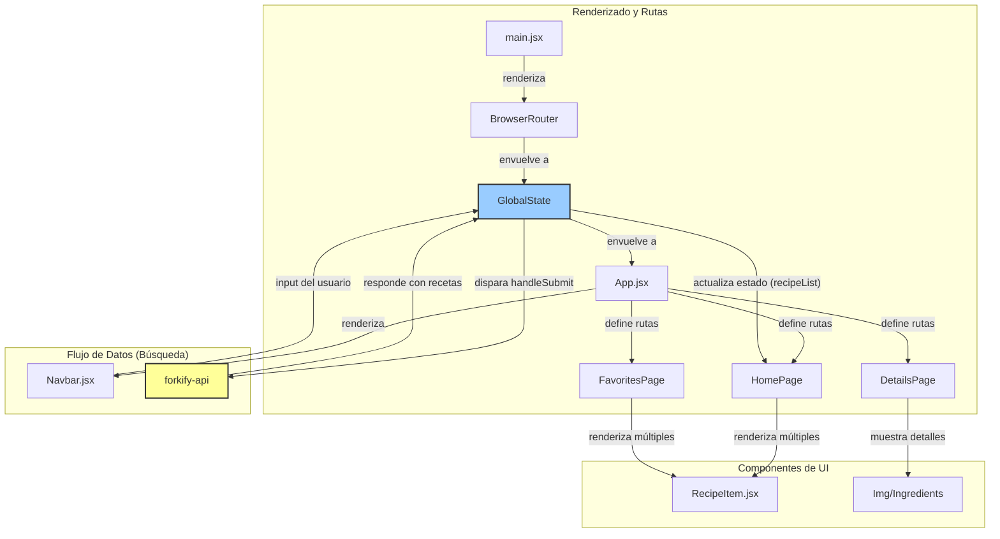

# API09: Buscador de Recetas

## 1. Descripción General

Esta aplicación es un buscador de recetas de cocina que consume datos de la API pública `forkify-api`. La interfaz permite a los usuarios buscar recetas por nombre, ver los detalles de cada una (ingredientes, imagen) y mantener una lista de favoritos persistente en la sesión.

El proyecto está construido aplicando principios de arquitectura de software moderna en React, con un enfoque en la separación de responsabilidades y una gestión de estado centralizada.

## 2. Tecnologías Utilizadas

- **Framework Frontend:** React 18
- **Gestión de Estado:** React Context API (`useContext` + `useState`)
- **Enrutamiento:** React Router DOM v6
- **Estilos:** Tailwind CSS
- **Bundler:** Vite
- **Linting:** ESLint

## 3. Arquitectura del Software

La arquitectura sigue un modelo basado en componentes con una estricta separación entre la lógica de negocio (centralizada en el Contexto de React) y la capa de presentación (los componentes y páginas).

### Diagrama de Arquitectura (Mermaid)



### Principios Clave Aplicados:

1.  **Separación de Lógica y Vista:** Toda la lógica de estado, las llamadas a la API y las funciones de mutación de datos (`handleSubmit`, `handleAddToFavorite`) fueron extraídas de los componentes de página y centralizadas en el componente `GlobalState` (`src/context/index.jsx`). Esto deja a las páginas (`Home`, `Details`) como componentes mayormente presentacionales.

2.  **Fuente Única de Verdad (Single Source of Truth):** Al centralizar todo el estado compartido (lista de recetas, favoritos, etc.) en el `GlobalContext`, se asegura que todos los componentes consuman y manipulen la misma información, evitando inconsistencias en la UI.

3.  **Enrutamiento Declarativo:** Se utiliza `react-router-dom` en `App.jsx` para definir de manera clara y legible qué componente de página corresponde a cada ruta de la aplicación, facilitando el mantenimiento y la adición de nuevas vistas.

---

### ### Mentoría: Aplicando SOLID en tu Proyecto

Aquí se explica cómo los principios SOLID se manifiestan en la arquitectura de este proyecto.

#### **S - Principio de Responsabilidad Única (SRP)**

Este principio establece que un componente o módulo debe tener una, y solo una, razón para cambiar.

*   **`GlobalState` (`src/context/index.jsx`):** Tiene la **única responsabilidad** de gestionar el estado global de la aplicación. Contiene toda la lógica de fetching de datos, manejo de favoritos y estado de la búsqueda. Si la forma en que se obtienen o se guardan los datos cambia, este es el único archivo que necesita ser modificado.

*   **`HomePage.jsx`:** Su **única responsabilidad** es mostrar la lista de recetas que recibe del contexto. No sabe cómo se obtienen, cómo se filtran ni de dónde vienen. Su única razón para cambiar sería un rediseño de la página de inicio.

*   **`RecipeItem.jsx`:** Su responsabilidad es aún más específica: renderizar la vista previa de **una sola receta**. Recibe los datos de un ítem y los muestra. Es un componente puramente presentacional y altamente reutilizable.

#### **O - Principio de Abierto/Cerrado**

Este principio dicta que las entidades de software deben estar abiertas a la extensión, pero cerradas a la modificación.

*   **Aplicación:** El componente `App.jsx` es un buen ejemplo.
    *   **Cerrado a la modificación:** La estructura base de `App.jsx` (renderizar el `Navbar` y un área para las rutas) es fija y no necesita cambiarse.
    *   **Abierto a la extensión:** Gracias al uso del componente `<Routes>`, podemos añadir nuevas páginas y rutas a la aplicación (ej. `<Route path="/profile" element={<ProfilePage />} />`) sin tener que modificar la lógica existente de `App.jsx`. Se extiende su funcionalidad (más páginas) sin alterar su código.

#### **D - Principio de Inversión de Dependencias (DIP)**

Este principio sugiere que los módulos de alto nivel no deben depender de los módulos de bajo nivel; ambos deben depender de abstracciones.

*   **Aplicación en React (Context API):** El Context API implementa este principio de forma natural.
    *   **Módulos de Alto Nivel:** Los componentes de página como `HomePage.jsx` o `DetailsPage.jsx`.
    *   **Módulo de Bajo Nivel:** La implementación concreta de la gestión del estado y las llamadas a la API (`fetch`, `useState`) dentro de `GlobalState`.
    *   **Abstracción:** El `GlobalContext`.

*   Los componentes de página no dependen directamente de `fetch` o de los `useState` específicos. Solo dependen de la "interfaz" (la abstracción) que les provee el contexto a través del hook `useContext`.

    ```jsx
    // src/pages/home/index.jsx
    const { recipeList, loading } = useContext(GlobalContext); // <-- Depende de la abstracción
    ```

    Gracias a esto, podríamos cambiar completamente la implementación interna de `GlobalState` (por ejemplo, pasar de `fetch` a `axios`, o incluso a Redux) y los componentes `HomePage` y `DetailsPage` **no requerirían ninguna modificación**, ya que su contrato con la abstracción (`GlobalContext`) no ha cambiado.

## 4. Instalación y Ejecución

1.  Clona el repositorio.
2.  Instala las dependencias:
    ```bash
    npm install
    ```
3.  Ejecuta el servidor de desarrollo:
    ```bash
    npm run dev
    ```