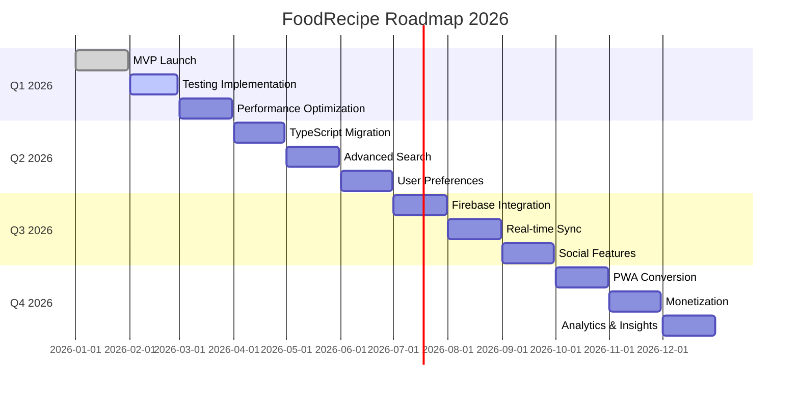

# Product Roadmap - FoodRecipe SPA

**Proyecto**: FoodRecipe  
**Versión Actual**: 1.0.0 (MVP)  
**Última Actualización**: 2026-01-22

---

## Visión del Producto

> Crear la aplicación de recetas más rápida, simple y hermosa del mercado, con sincronización en tiempo real y personalización basada en preferencias del usuario.

---

## Roadmap Visual



---

## Q1 2026: Foundation & Quality

### ✅ Enero: MVP Launch (COMPLETADO)

**Objetivo**: Lanzar MVP funcional con features core

**Features Entregadas**:

- ✅ Búsqueda de recetas
- ✅ Visualización de detalles
- ✅ Sistema de favoritos (localStorage)
- ✅ Navegación SPA
- ✅ Responsive design
- ✅ Documentación completa (SCRUM, ADRs, Riesgos)

**Métricas**:

- Bundle size: 85KB (gzipped)
- Lighthouse Score: 95/100
- 0 errores de linting

---

### 🔄 Febrero: Testing Implementation

**Objetivo**: Implementar testing automatizado para asegurar calidad

**Features Planificadas**:

1. **Unit Tests** (Semana 1-2)
   - Vitest + Testing Library
   - Tests para hooks (useSearch, useFavorites)
   - Tests para utils y helpers
   - **Target**: >50% cobertura

2. **Component Tests** (Semana 3)
   - Tests para RecipeCard
   - Tests para Navbar
   - Tests para páginas
   - **Target**: >60% cobertura

3. **Integration Tests** (Semana 4)
   - Flujo completo de búsqueda
   - Flujo de agregar/quitar favoritos
   - Navegación entre páginas
   - **Target**: >70% cobertura

**Esfuerzo**: 2 sprints (4 semanas)  
**Owner**: Software Engineer

**Entregables**:

- [ ] Vitest configurado
- [ ] > 70% test coverage
- [ ] CI/CD con tests automáticos
- [ ] Badge de coverage en README

---

### 🔄 Marzo: Performance Optimization

**Objetivo**: Optimizar performance para Core Web Vitals

**Features Planificadas**:

1. **Image Optimization** (Semana 1)
   - Lazy loading mejorado
   - Placeholder blur-up
   - WebP format
   - Responsive images (srcset)

2. **Code Splitting** (Semana 2)
   - Split por ruta
   - Lazy load de componentes pesados
   - Prefetch de rutas

3. **Caching Strategy** (Semana 3-4)
   - Service Worker básico
   - Cache de API responses
   - Stale-while-revalidate

**Esfuerzo**: 1 sprint (2 semanas)  
**Owner**: Frontend Developer

**Métricas Target**:

- LCP (Largest Contentful Paint): <2.5s
- FID (First Input Delay): <100ms
- CLS (Cumulative Layout Shift): <0.1
- Lighthouse Score: >98/100

---

## Q2 2026: Enhanced Features

### 🔄 Abril: TypeScript Migration

**Objetivo**: Migrar de JavaScript + PropTypes a TypeScript

**Features Planificadas**:

1. **Setup** (Semana 1)
   - Instalar TypeScript + tipos
   - Configurar tsconfig.json
   - Configurar Vite para TS

2. **Migration** (Semana 2-3)
   - Renombrar .js → .ts, .jsx → .tsx
   - Agregar tipos a hooks
   - Agregar tipos a componentes
   - Agregar tipos a API services

3. **Refinement** (Semana 4)
   - Eliminar PropTypes
   - Strict mode
   - Resolver todos los errores de tipo

**Esfuerzo**: 1 sprint (2 semanas)  
**Owner**: Software Engineer

**Beneficios**:

- Autocomplete mejorado
- Refactoring seguro
- Menos bugs en producción
- Mejor DX (Developer Experience)

---

### 🔄 Mayo: Advanced Search

**Objetivo**: Mejorar búsqueda con filtros y ordenamiento

**Features Planificadas**:

1. **Filters** (Semana 1-2)
   - Filtro por tipo de comida (breakfast, lunch, dinner)
   - Filtro por dieta (vegan, vegetarian, keto, paleo)
   - Filtro por tiempo de cocción (<30min, 30-60min, >60min)
   - Filtro por dificultad (easy, medium, hard)

2. **Sorting** (Semana 3)
   - Ordenar por relevancia
   - Ordenar por tiempo de cocción
   - Ordenar por popularidad

3. **Search History** (Semana 4)
   - Guardar últimas 10 búsquedas
   - Quick access a búsquedas recientes
   - Clear history

**Esfuerzo**: 2 sprints (4 semanas)  
**Owner**: Frontend Developer

**UI Mockup**:

```
┌─────────────────────────────────────┐
│ Search: [pizza____________] [🔍]   │
├─────────────────────────────────────┤
│ Filters:                            │
│ ☐ Vegan  ☐ Vegetarian  ☐ Keto     │
│ ☐ <30min  ☐ 30-60min  ☐ >60min    │
│                                     │
│ Sort by: [Relevance ▼]             │
└─────────────────────────────────────┘
```

---

### 🔄 Junio: User Preferences

**Objetivo**: Personalizar experiencia según preferencias del usuario

**Features Planificadas**:

1. **Dietary Preferences** (Semana 1-2)
   - Seleccionar dietas (vegan, keto, etc.)
   - Filtrar automáticamente recetas
   - Guardar en localStorage

2. **Ingredient Blacklist** (Semana 3)
   - Agregar ingredientes a evitar
   - Ocultar recetas con esos ingredientes
   - Sugerencias de sustitutos

3. **Theme Customization** (Semana 4)
   - Dark mode
   - Accent color picker
   - Font size adjustment

**Esfuerzo**: 2 sprints (4 semanas)  
**Owner**: UX/UI Designer + Frontend Developer

**Impacto**:

- Mejor UX personalizada
- Mayor engagement
- Retención mejorada

---

## Q3 2026: Backend & Sync

### 🔄 Julio: Firebase Integration

**Objetivo**: Migrar de localStorage a Firebase para sincronización

**Features Planificadas**:

1. **Firebase Setup** (Semana 1)
   - Crear proyecto Firebase
   - Configurar Firestore
   - Configurar Authentication

2. **Authentication** (Semana 2)
   - Google Sign-In
   - Email/Password
   - Anonymous auth (para probar)

3. **Firestore Migration** (Semana 3-4)
   - Migrar favoritos a Firestore
   - Migrar preferencias a Firestore
   - Migrar search history a Firestore

**Esfuerzo**: 2 sprints (4 semanas)  
**Owner**: Software Engineer

**Arquitectura**:

```
┌──────────────┐
│   Frontend   │
│  (React SPA) │
└──────┬───────┘
       │
       ▼
┌──────────────┐
│   Firebase   │
│ ┌──────────┐ │
│ │   Auth   │ │
│ └──────────┘ │
│ ┌──────────┐ │
│ │Firestore │ │
│ └──────────┘ │
└──────────────┘
```

---

### 🔄 Agosto: Real-time Sync

**Objetivo**: Sincronizar favoritos en tiempo real entre dispositivos

**Features Planificadas**:

1. **Real-time Listeners** (Semana 1-2)
   - Escuchar cambios en Firestore
   - Actualizar UI automáticamente
   - Optimistic updates

2. **Offline Support** (Semana 3)
   - Firestore offline persistence
   - Sync cuando vuelve online
   - Conflict resolution

3. **Multi-device UX** (Semana 4)
   - Indicador de "Syncing..."
   - Notificación de cambios
   - Device management

**Esfuerzo**: 2 sprints (4 semanas)  
**Owner**: Frontend Developer

**UX Flow**:

```
Device A: Add favorite → Firestore → Device B: Auto-update
   ↓                                        ↓
"Syncing..."                          "Recipe added!"
```

---

### 🔄 Septiembre: Social Features

**Objetivo**: Agregar features sociales para aumentar engagement

**Features Planificadas**:

1. **Recipe Collections** (Semana 1-2)
   - Crear colecciones (ej: "Keto Meals", "Quick Dinners")
   - Agregar recetas a colecciones
   - Compartir colecciones

2. **Share Recipes** (Semana 3)
   - Compartir receta por link
   - Compartir en redes sociales
   - Copy to clipboard

3. **Recipe Notes** (Semana 4)
   - Agregar notas personales a recetas
   - Modificar ingredientes
   - Guardar variaciones

**Esfuerzo**: 2 sprints (4 semanas)  
**Owner**: Frontend Developer + UX/UI Designer

**Impacto**:

- Viral growth (compartir)
- Mayor engagement
- Retención mejorada

---

## Q4 2026: PWA & Monetization

### 🔄 Octubre: PWA Conversion

**Objetivo**: Convertir a Progressive Web App para instalación

**Features Planificadas**:

1. **Service Worker** (Semana 1-2)
   - Cache de assets
   - Offline mode completo
   - Background sync

2. **Manifest & Icons** (Semana 3)
   - Web app manifest
   - App icons (todos los tamaños)
   - Splash screens

3. **Install Prompt** (Semana 4)
   - Detectar si es instalable
   - Mostrar prompt de instalación
   - A2HS (Add to Home Screen)

**Esfuerzo**: 2 sprints (4 semanas)  
**Owner**: Frontend Developer

**Beneficios**:

- App-like experience
- Funciona offline
- Notificaciones push (futuro)

---

### 🔄 Noviembre: Monetization

**Objetivo**: Implementar modelo de negocio para sostenibilidad

**Features Planificadas**:

1. **Free Tier** (Semana 1)
   - Límite de 50 favoritos
   - Ads en resultados de búsqueda
   - Features básicas

2. **Premium Tier** ($2.99/mes) (Semana 2-3)
   - Favoritos ilimitados
   - Sin ads
   - Recetas exclusivas
   - Meal planning
   - Grocery list

3. **Payment Integration** (Semana 4)
   - Stripe integration
   - Subscription management
   - Cancel/upgrade flow

**Esfuerzo**: 2 sprints (4 semanas)  
**Owner**: Product Owner + Software Engineer

**Pricing**:

```
┌─────────────┬─────────────┐
│    FREE     │   PREMIUM   │
├─────────────┼─────────────┤
│ 50 favs     │ Unlimited   │
│ With ads    │ No ads      │
│ Basic       │ Exclusive   │
│             │ Meal plan   │
│ $0/mo       │ $2.99/mo    │
└─────────────┴─────────────┘
```

---

### 🔄 Diciembre: Analytics & Insights

**Objetivo**: Implementar analytics para decisiones data-driven

**Features Planificadas**:

1. **User Analytics** (Semana 1-2)
   - Google Analytics 4
   - Event tracking (search, favorite, share)
   - User journey mapping

2. **Recipe Insights** (Semana 3)
   - Most searched recipes
   - Most favorited recipes
   - Trending recipes

3. **Dashboard** (Semana 4)
   - Admin dashboard
   - User metrics
   - Revenue metrics
   - Engagement metrics

**Esfuerzo**: 2 sprints (4 semanas)  
**Owner**: Software Engineer

**Métricas a Trackear**:

- DAU (Daily Active Users)
- MAU (Monthly Active Users)
- Retention rate
- Conversion rate (free → premium)
- Churn rate

---

## 2027 y Más Allá

### Q1 2027: AI-Powered Features

- **Recipe Recommendations**: ML para sugerir recetas basadas en historial
- **Ingredient Recognition**: OCR para escanear ingredientes
- **Meal Planning AI**: Generar meal plans automáticos

### Q2 2027: Community Features

- **User-Generated Recipes**: Permitir a usuarios subir recetas
- **Recipe Reviews**: Rating y reviews
- **Comments**: Comentarios en recetas

### Q3 2027: E-commerce Integration

- **Grocery Delivery**: Integración con Instacart, Amazon Fresh
- **Kitchen Tools**: Affiliate links a utensilios
- **Meal Kits**: Partnership con HelloFresh, Blue Apron

### Q4 2027: International Expansion

- **Multi-language**: Español, Francés, Alemán
- **Regional Recipes**: Recetas por región
- **Currency Support**: Múltiples monedas

---

## Métricas de Éxito

### 2026 Targets

| Métrica                         | Q1  | Q2  | Q3    | Q4     |
| ------------------------------- | --- | --- | ----- | ------ |
| MAU (Monthly Active Users)      | 100 | 500 | 2,000 | 10,000 |
| Premium Subscribers             | 0   | 0   | 0     | 500    |
| MRR (Monthly Recurring Revenue) | $0  | $0  | $0    | $1,500 |
| Test Coverage                   | 0%  | 70% | 80%   | 90%    |
| Lighthouse Score                | 95  | 98  | 99    | 100    |

---

## Dependencias y Riesgos

### Dependencias Críticas

1. **Forkify API**: Migrar a API propia en Q3 2026
2. **Firebase**: Setup en Q3 2026
3. **Stripe**: Setup en Q4 2026

### Riesgos

1. **Competencia**: Mercado saturado → Diferenciación por UX
2. **Monetización**: Usuarios no quieren pagar → Freemium model
3. **Escalabilidad**: Firebase costs → Monitorear y optimizar

---

## Proceso de Roadmap

### Revisión

- **Frecuencia**: Cada Sprint Review
- **Responsable**: Product Owner
- **Acción**: Ajustar prioridades según feedback

### Criterios de Priorización

1. **Impact**: ¿Cuánto valor agrega al usuario?
2. **Effort**: ¿Cuánto tiempo toma implementar?
3. **Risk**: ¿Qué tan riesgoso es?
4. **Dependencies**: ¿Qué depende de esto?

**Framework**: RICE (Reach, Impact, Confidence, Effort)

---

## Conclusión

Este roadmap refleja una evolución clara del producto:

**2026 Q1-Q2**: Foundation (Testing, TypeScript, Advanced Search)  
**2026 Q3**: Backend (Firebase, Sync, Social)  
**2026 Q4**: Monetization (PWA, Premium, Analytics)  
**2027+**: AI, Community, E-commerce, International

El objetivo es lanzar un MVP sólido, validar con usuarios, y escalar features basado en feedback y métricas.
